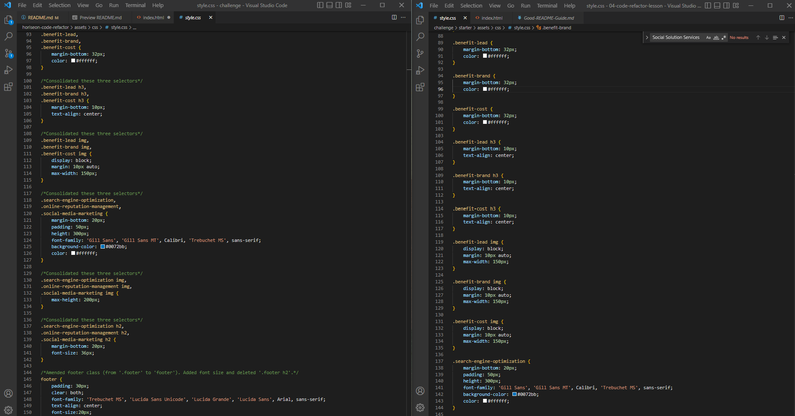

# Horiseon Refactor

## About this project

Hired by the Marketing Manager to refactor their landing page - Horiseon, Social Solution Services.
Tasked to improve their existing codebase to ensure it is more accessible and optimized for search engines. 

Previously, there were several elements in the HTML and CSS file that needed to be repaired, consolidated and tested. The following changes were made to achieve the Marketing Managers criteria:

- [x] Updated the title of the webpage to read 'Horiseon Social Solution Services'.
- [x] Meta viewport tag added to allow users to be able to see from any device or monitor, reaching our to a wider audience.
- [x] CSS selectors and properties have been reworked, consolidated repeating CSS.
- [x] HTML elements and Heading attributes follow a logical structure.
- [x] Image and icon elements contain descriptive 'alt' attributes incase these fail to load in the future.
- [x] All links in the navigation bar and the 'seo' in 'Horiseon' are functioning correctly.
- [x] All div's were replaced with semantic elements.
- [x] Explanatory comments added to both HTML and CSS to allow other developers to understand the changes.
- [x] Quality README was created.
- [x] Website has been validated using w3 to ensure no errors.

## Screenshot
The following shows the web applications appearance:

The following shows two VSC windows for comparison. Left side (after) shows how repeating CSS selectors have been consolidated and the right side (before) shows the original code having been repeated. Both achieves the same results except the consolidated CSS is grouped together looking more simpler, taking up less line space and easy to manage:

## Project Link
Application can can be viewed here: 
* [Live](https://tahminahannan.github.io/horiseon-code-refactor/)

* [Repository](https://github.com/TahminaHannan/horiseon-code-refactor)

## Built with:
Note: The website layout is designed for desktop viewing, you may notice that some of the elements don't look like the mock-up at a resolution smaller than 768px.
* HTML
* CSS
* Gitbash

## Tests
Tested the website functionality using:
* [w3 - Validator](https://validator.w3.org/nu/)

## Credits
I would like to thank the following resources:
* [w3 - Validator](https://validator.w3.org/nu/)
* [w3 - Semantic HTML](https://www.w3schools.com/html/html5_semantic_elements.asp)
* [Reliable Soft - Image alt attribute](https://www.reliablesoft.net/alt-text/)
* [Stack overflow - Consolidating CSS](https://stackoverflow.com/questions/48593160/how-to-combine-two-classes-that-have-same-properties)
* [Stack overflow - link in h1 tag with span](https://stackoverflow.com/questions/64310371/two-lines-with-link-and-span-in-h1-tag)
* [Github - Basic writing syntax](https://docs.github.com/en/get-started/writing-on-github/getting-started-with-writing-and-formatting-on-github/basic-writing-and-formatting-syntax)

## License
Distributed under the MIT License. See LICENSE.txt for more information.

